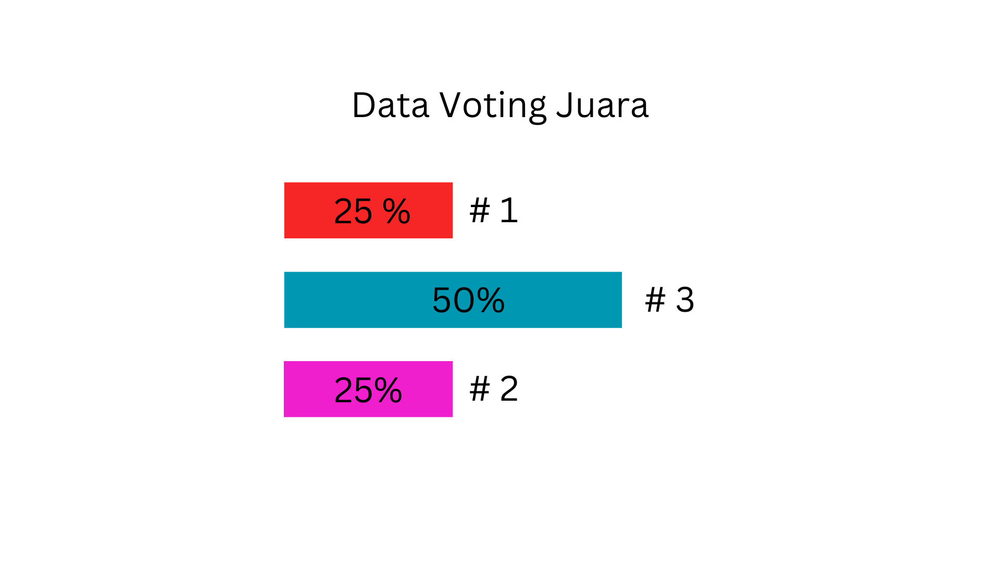
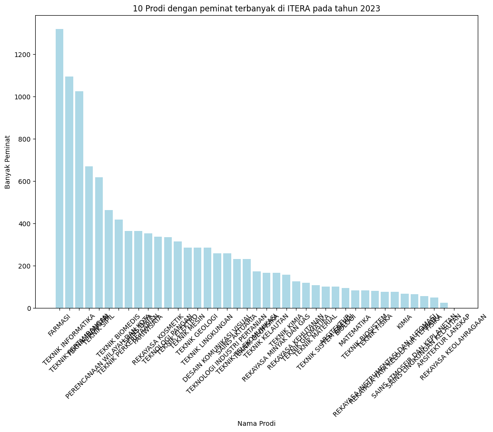
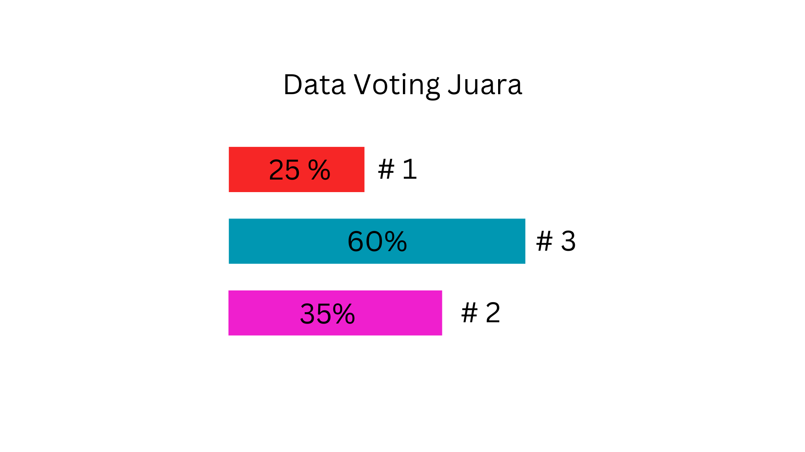
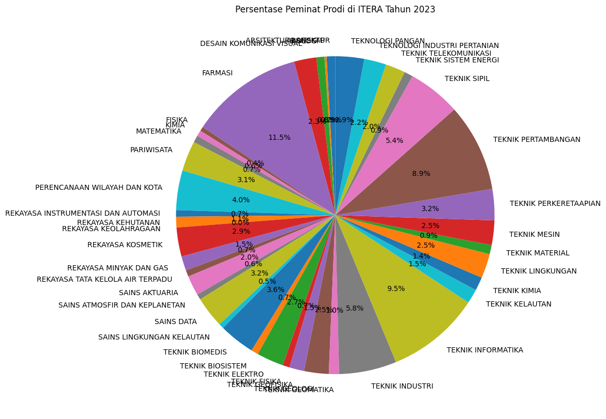

- **Nama** : Jeremia Susanto
- **NIM** : 122450022
- **Kelas** :  RA

# Tugas 2 VDI
## Visual Baik
### Gambar 1

### Gambar 2

## Visual Buruk
### Gambar 3

### Gambar 4

## Kesimpulan 
Berdasarkan kedua gambar visualisasi yang telah diunggah, berikut adalah analisis berdasarkan empat prinsip visualisasi data yang baik:

#### Gambar 2: Histogram "10 Prodi dengan Peminat Terbanyak di ITERA pada tahun 2023"
- **Strive for Forms and Functions (Bentuk dan Fungsi)**:
  - Histogram ini berfungsi dengan baik dalam menampilkan jumlah peminat untuk setiap program studi secara terurut dari yang terbanyak ke yang paling sedikit. Bentuk batang yang jelas memudahkan pembaca untuk membandingkan popularitas antar program studi.
  
- **Justifying the Selection of Everything We Do (Justifikasi Setiap Elemen)**:
  - Warna yang dipilih (biru muda) cukup sederhana dan tidak mengganggu perhatian pembaca. Penempatan sumbu dan label pada sumbu x serta y sudah terstruktur dengan baik dan mudah dipahami.
  
- **Creating Accessibility through Intuitive Design (Aksesibilitas melalui Desain Intuitif)**:
  - Desainnya intuitif dan menyampaikan informasi dengan jelas. Namun, satu catatan penting adalah penggunaan nama program studi pada sumbu x yang diputar 45 derajat bisa mengurangi kejelasan, terutama jika pembaca harus memiringkan kepala untuk membaca teks tersebut. Penggunaan singkatan atau penempatan yang lebih baik bisa membantu.
  
- **Never Deceive the Receiver (Tidak Menyesatkan Pengguna)**:
  - Tidak ada indikasi penyesatan di visualisasi ini. Grafik ini memberikan informasi yang benar sesuai data dengan skala yang konsisten dan tidak mengarahkan pembaca pada interpretasi yang salah.

#### Gambar 4: Pie Chart "Persentase Peminat Prodi di ITERA Tahun 2023"
- **Strive for Forms and Functions (Bentuk dan Fungsi)**:
  - Pie chart ini mencoba menampilkan persentase peminat untuk banyak program studi sekaligus. Namun, karena banyaknya kategori, informasi yang disampaikan menjadi sulit dipahami.
  
- **Justifying the Selection of Everything We Do (Justifikasi Setiap Elemen)**:
  - Penggunaan warna yang beragam untuk membedakan setiap program studi seharusnya membantu, tetapi pemilihan terlalu banyak warna dengan saturasi yang mirip membuat visual ini sulit dibaca. Label yang diposisikan di luar grafik juga bertumpuk dan berpotensi membingungkan pembaca.
  
- **Creating Accessibility through Intuitive Design (Aksesibilitas melalui Desain Intuitif)**:
  - Pie chart ini tidak intuitif karena terlalu banyak bagian kecil dengan nilai persentase yang mendekati satu sama lain. Hal ini menyebabkan pembaca kesulitan untuk melihat perbedaan antar program studi. Sebaiknya, visualisasi ini bisa diubah ke dalam bentuk lain, seperti bar chart, agar lebih mudah dibaca.
  
- **Never Deceive the Receiver (Tidak Menyesatkan Pengguna)**:
  - Grafik ini tidak menyesatkan, tetapi karena visualisasi terlalu padat, pembaca mungkin kesulitan menangkap pesan utama yang ingin disampaikan. Ini dapat membuat interpretasi data tidak optimal.

- **Gambar 2 (Histogram)**: Visualisasi yang baik karena menyajikan informasi dengan jelas, struktur yang baik, dan tidak menyesatkan.
- **Gambar 4 (Pie Chart)**: Visualisasi yang kurang efektif karena terlalu banyak informasi dalam satu visual, membuat pembaca sulit membedakan kategori dan memahami persentase secara keseluruhan.

-------------------------------------------------------

#### Gambar 1 : Barchart "Data Voting Juara
- **Strive for Forms and Functions (Bentuk dan Fungsi)**:
  - Barchart ini berfungsi dengan baik dalam menampilkan jumlah voting untuk setiap pilihan. Bentuk batang yang jelas memudahkan pembaca untuk membandingkan.
  
- **Justifying the Selection of Everything We Do (Justifikasi Setiap Elemen)**:
  - Warna yang dipilih cukup beragam dan tidak mengganggu perhatian pembaca. Penempatan label sudah terstruktur dengan baik dan mudah dipahami.
  
- **Creating Accessibility through Intuitive Design (Aksesibilitas melalui Desain Intuitif)**:
  - Desainnya intuitif dan menyampaikan informasi dengan jelas.
  
- **Never Deceive the Receiver (Tidak Menyesatkan Pengguna)**:
  - Tidak ada indikasi penyesatan di visualisasi ini. Grafik ini memberikan informasi yang benar sesuai data dengan skala yang konsisten dan tidak mengarahkan pembaca pada interpretasi yang salah.

#### Gambar 4: Pie Chart "Persentase Peminat Prodi di ITERA Tahun 2023"
- **Strive for Forms and Functions (Bentuk dan Fungsi)**:
  - Pie chart ini mencoba menampilkan persentase peminat untuk banyak program studi sekaligus. Namun, karena banyaknya kategori, informasi yang disampaikan menjadi sulit dipahami.
  
- **Justifying the Selection of Everything We Do (Justifikasi Setiap Elemen)**:
  - Penggunaan warna yang beragam untuk membedakan setiap program studi seharusnya membantu, tetapi pemilihan terlalu banyak warna dengan saturasi yang mirip membuat visual ini sulit dibaca. Label yang diposisikan di luar grafik juga bertumpuk dan berpotensi membingungkan pembaca.
  
- **Creating Accessibility through Intuitive Design (Aksesibilitas melalui Desain Intuitif)**:
  - Pie chart ini tidak intuitif karena terlalu banyak bagian kecil dengan nilai persentase yang mendekati satu sama lain. Hal ini menyebabkan pembaca kesulitan untuk melihat perbedaan antar program studi. Sebaiknya, visualisasi ini bisa diubah ke dalam bentuk lain, seperti bar chart, agar lebih mudah dibaca.
  
- **Never Deceive the Receiver (Tidak Menyesatkan Pengguna)**:
  - Grafik ini tidak menyesatkan, tetapi karena visualisasi terlalu padat, pembaca mungkin kesulitan menangkap pesan utama yang ingin disampaikan. Ini dapat membuat interpretasi data tidak optimal.

- **Gambar 2 (Histogram)**: Visualisasi yang baik karena menyajikan informasi dengan jelas, struktur yang baik, dan tidak menyesatkan.
- **Gambar 4 (Pie Chart)**: Visualisasi yang kurang efektif karena terlalu banyak informasi dalam satu visual, membuat pembaca sulit membedakan kategori dan memahami persentase secara keseluruhan.
